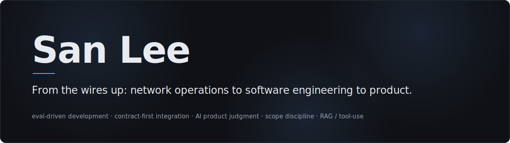

<picture>
  <source media="(prefers-color-scheme: dark)" srcset="images/banner-dark.svg">
  <source media="(prefers-color-scheme: light)" srcset="images/banner-light.svg">
  
</picture>

Network operations to software engineering to product. I'm a Senior Product Associate at
JPMorganChase now, building AI tools on the side to stay hands-on.

These projects started as a way to dust off years of accumulated engineering rust and turned 
into work I can actually stand behind technically. They're built by directing Claude: I set 
the direction, the contracts, and the bar; it does most of the typing; the evals and 
postmortems are the proof. Odd career path, I know. The bet I'm hedging *with* (and not 
against) is AI.

**See it as one system → [sanlee.me](https://sanlee.me).** The repos below are the parts. The site is how they fit together, the decisions behind each call, and an honest note on how it was built.

## What I'm building

**[kb-agent](https://github.com/sanlee-ys/kb-agent)** — 
Personal, living knowledge base over your projects and their dependencies. A local 
Claude RAG + tool-use agent you can query or point at your projects' running services, 
and now an MCP server any MCP host can mount. Answers cite their KB sources.

**[defense-news-classifier](https://github.com/sanlee-ys/defense-news-classifier)** — 
LLM classifier for public defense news snippets: category + operational domain via 
structured output, graded against a human-labeled eval that now gates CI. Currently 88.9% 
category / 94.4% domain accuracy after an eval-gated Sonnet 5 migration. Retrieval was 
measured twice and lost twice (marginal lift on Sonnet 4.6, a 9.3-point regression on 5), 
so I shipped the negative result instead of reaching for embeddings.

**[learning-notes](https://github.com/sanlee-ys/learning-notes)** — 
Plain-language notes on the concepts behind these projects: tool use, RAG, evals, 
embeddings, and how I steer AI agents. Read them as a searchable page, a MkDocs site, an 
interactive D3 concept map, or through kb-agent chat with citations.

**[claude-ops](https://github.com/sanlee-ys/claude-ops)** — 
The operating layer for the Claude-assisted workflow this page describes: a credential-guard 
hook hardened across four documented leak incidents, blameless postmortems with the failures 
left in, and the working agreements that scope each session.

**[architecture](https://github.com/sanlee-ys/architecture)** — 
System-level architecture decisions (ADRs) that span more than one project, plus the system 
portal that pulls every repo's docs into one place on GitHub Pages.

**[notes-api](https://github.com/sanlee-ys/notes-api)** — 
Python/FastAPI notes REST API with SQLAlchemy; async tag enrichment via BackgroundTasks seam to the defense-news-classifier.

## Day job
In Employee Platforms, I run product for SharePoint Online and OneDrive — the collaboration 
platforms every JPMorganChase line of business works in. The work: lifecycle, migration, and 
automating the operations around both.

## Stack
**Now:** Python · FastAPI · Anthropic API (tool use, MCP, evals) · GitHub Actions · vanilla JS + D3 · Microsoft 365 · Jira  
**Earlier (SWE):** Python · Java · Kafka · event-driven microservices · CockroachDB · Cassandra · MySQL · Kubernetes · Docker · OpenTelemetry

## Background
Seoul National University MBA · B.A. Information Technology, Rutgers–New Brunswick · AWS Certified Cloud Practitioner · U.S. Army National Guard veteran (Qatar, OEF)

Outside work: photography, hiking, and supervised by a Scottish Fold named Sango.

<a href="https://www.linkedin.com/in/leesan/">LinkedIn</a> · <a href="https://www.instagram.com/sanleeeee/">Instagram</a> · <a href="https://vsco.co/sanlee">VSCO</a> · <a href="https://sanlee.me">Portfolio</a>

  

<em>Sango, Chief Nap Officer.</em>

