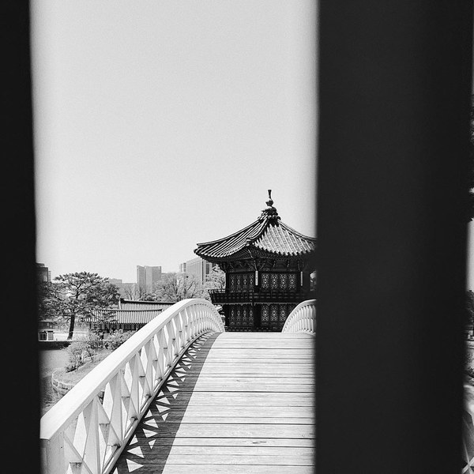
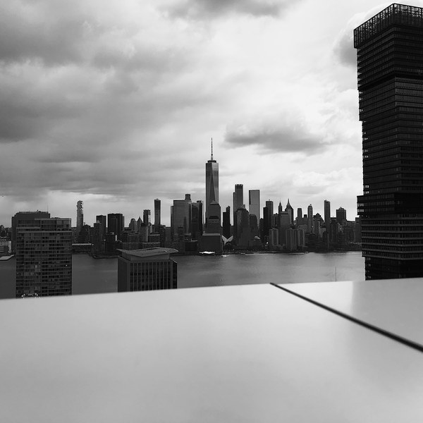

<table border="0">
  <tr>
    <td valign="top">
      <h1>Hi, I'm San 👋</h1>
      
Technical PM at JPMorgan Chase with an engineering background (~8 years as a
      software engineer before moving to product). Building AI tools on the side to
      stay hands-on.

    </td>
    <td width="190" valign="top">
      
    </td>
  </tr>
</table>

## What I'm building

**[defense-news-classifier](https://github.com/sanlee-ys/defense-news-classifier)** — 
LLM classifier for public defense news snippets. Assigns category and operational domain 
using structured JSON output via the Anthropic API. Built a real eval harness: 97.3% 
accuracy on domain, 79% on category, with per-label F1 and a full misclassification log.

## Day job
Currently own SharePoint Online and OneDrive for 300k+ employees at JPMorgan Chase. 
Prior to that: infrastructure engineering, ZTP, CI/CD modernization.

## Stack
Python · Anthropic API · AWS · Kubernetes · Docker · Jira · Microsoft 365

## Background
SNU MBA · AWS Certified Cloud Practitioner · U.S. Army National Guard veteran (Qatar, OEF)

Outside work: photography, hiking, and supervised by a Scottish Fold named Sango.

A few frames I've shot and edited (mostly on VSCO) — full gallery at **[vsco.co/sanlee](https://vsco.co/sanlee)**:

  
  
  
  
  
  

## Meet the supervisor 🐱

  
  
  

*Sango — Chief Nap Officer, occasional pumpkin.*
