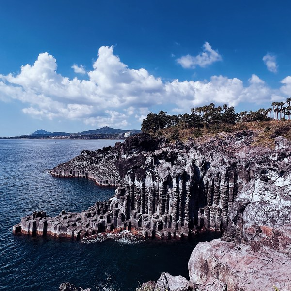

# Hi, I'm San 👋

Network operations to software engineering to product. I'm a Senior Product Associate at
JPMorganChase now, building AI tools on the side to stay hands-on.

What started as a way to dust off years of accumulated engineering rust turned into something 
more. A way to build on what I've picked up over the years and turn it into work I can actually 
stand behind technically, while pushing me into the domains I'm trying to explore.

It's also my disclaimer: Claude's helping me move a lot faster. Even the little things like 
setting up boilerplate or working in a `.venv` without tripping over it took real time to 
learn. Now I'm orchestrating tightly scoped sessions and letting Claude do most of the rest.

I'm having fun while I'm (re)learning on-the-go. If you couldn't tell by now, I've had 
something of an odd career path. That's another story, but the bet I'm hedging *with* (and not 
against) is AI.

## What I'm building

**[kb-agent](https://github.com/sanlee-ys/kb-agent)** — 
Personal, living knowledge base over your projects and their dependencies. A local 
Claude RAG + tool-use agent you can ask questions, or point at your projects' own 
running services to have it call them directly.

**[defense-news-classifier](https://github.com/sanlee-ys/defense-news-classifier)** — 
LLM classifier for public defense news snippets. Assigns category and operational domain 
using structured JSON output via the Anthropic API. Built a real eval harness, measured on 
real, human-labeled public text: 88.9% accuracy on both category and operational domain 
(macro-F1 0.906 and 0.894), with per-label F1 and a full misclassification log.

**[learning-notes](https://github.com/sanlee-ys/learning-notes)** — 
Plain-language notes on the concepts behind these projects — tool use, RAG, evals, 
embeddings, model routing. Three ways to read them: a searchable page, a MkDocs site, and 
an interactive D3 concept map that links each idea to the ones it builds on.

**[architecture](https://github.com/sanlee-ys/architecture)** — 
System-level architecture decisions (ADRs) that span more than one project — the home for 
the cross-cutting choices that don't belong in any single repo.

**[notes-api](https://github.com/sanlee-ys/notes-api)** — 
Python/FastAPI notes REST API with SQLAlchemy; async tag enrichment via BackgroundTasks seam to the defense-news-classifier.

## Day job
In Employee Platforms, responsible for the product lifecycle, migration, and automation of 
enterprise collaboration platforms (SharePoint Online & OneDrive) across all lines of business.

## Stack
**Now:** Python · Anthropic API · AWS · Jira · Microsoft 365  
**Earlier (SWE):** Python · Java · Kafka · event-driven microservices · CockroachDB · Cassandra · MySQL · Kubernetes · Docker · OpenTelemetry

## Background
Seoul National University MBA · B.A. Information Technology, Rutgers–New Brunswick · AWS Certified Cloud Practitioner · U.S. Army National Guard veteran (Qatar, OEF)

Outside work: photography, hiking, and supervised by a Scottish Fold named Sango.

A few frames I've shot and edited (mostly on VSCO) — full gallery at **[vsco.co/sanlee](https://vsco.co/sanlee)**:

  
  
  
  
  
  

## Meet the supervisor 🐱

  
  
  

*Sango — Chief Nap Officer, occasional pumpkin.*
