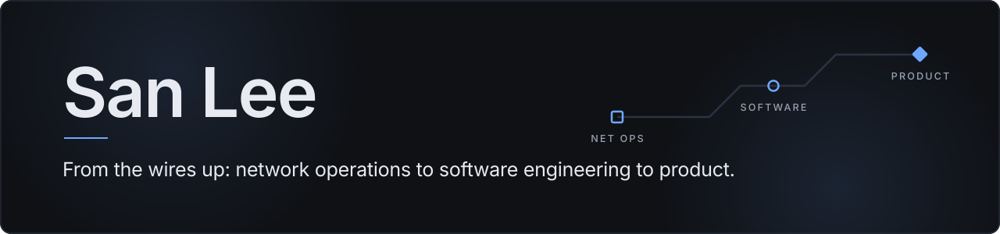

<picture>
  <source media="(prefers-color-scheme: dark)" srcset="images/banner-dark.svg">
  <source media="(prefers-color-scheme: light)" srcset="images/banner-light.svg">
  
</picture>

Network operations to software engineering to product. I'm a Senior Product Associate at
JPMorganChase, building AI tools on the side by directing Claude: I set the direction, the
contracts, and the bar; it does most of the typing; the evals and postmortems are the proof.

**See it as one system → [sanlee.me](https://sanlee.me).** The repos below are the parts; the site is how they fit together and the decisions behind each call.

## What I'm building

**[defense-news-classifier](https://github.com/sanlee-ys/defense-news-classifier)** — 
LLM classifier for public defense news: category, operational domain, and region via 
structured tool-use, served as a containerized FastAPI endpoint two other repos here call. 
<!-- version:classifier -->v3.1.0 scores <!-- metric:category_accuracy -->92.6% category / 
<!-- metric:domain_accuracy -->92.6% domain / <!-- metric:region_accuracy -->87.0% region 
against a human answer key whose accuracy floors block every PR. Two escalations were 
measured and declined, including tiered routing at +0 rows for ~1.97x the cost.

**[claude-ops](https://github.com/sanlee-ys/claude-ops)** — 
The operating layer for this workflow: a `PreToolUse` credential-guard hook 
rebuilt into a path-based default-deny after four credential-exposure events in one 
week. A 63-test suite gates CI, 28 of them pinned red-team findings, plus a test class 
asserting the shapes the guard deliberately does *not* block, so its own boundary fails the 
build if a later fix quietly widens it.

**[kb-agent](https://github.com/sanlee-ys/kb-agent)** — 
A knowledge base over my projects and their dependencies, served from one tool 
implementation across two transports: a Claude tool-use agent and an MCP server any host can 
mount, sharing the same functions and descriptions. Retrieval is graded against a 
hand-labeled 27-query gold set (recall@5 0.926, MRR 0.781).

**[faithfulness-judge](https://github.com/sanlee-ys/faithfulness-judge)** — 
Measures whether an LLM judge can be trusted to catch unsupported claims, scored against 189 
human-labeled claims on public defense text. Both tiers land in substantial agreement (Opus 
κ 0.751, Sonnet κ 0.716) and neither axis separates them. Two of the numbers here are 
corrections I published against myself.

Also public: **[architecture](https://github.com/sanlee-ys/architecture)** (cross-repo ADRs 
and the system portal), **[notes-api](https://github.com/sanlee-ys/notes-api)** (FastAPI 
service with an async enrichment seam to the classifier), and 
**[learning-notes](https://github.com/sanlee-ys/learning-notes)** (plain-language notes on 
the concepts behind all of it).

## Day job
In Employee Platforms, I run product for SharePoint Online and OneDrive — the collaboration 
platforms every JPMorganChase line of business works in. The work: lifecycle, migration, and 
automating the operations around both.

## Stack
**Now:** Python · FastAPI · Anthropic API (tool use, MCP, evals) · GitHub Actions · vanilla JS + D3 · Microsoft 365 · Jira  
**Earlier (SWE):** Python · Java · Kafka · event-driven microservices · CockroachDB · Cassandra · MySQL · Kubernetes · Docker · OpenTelemetry

## Background
Seoul National University MBA · B.A. Information Technology, Rutgers–New Brunswick · U.S. Army National Guard veteran (Qatar, OEF)

Outside work: photography, hiking, and supervised by a Scottish Fold named Sango.

<a href="https://www.linkedin.com/in/leesan/">LinkedIn</a> · <a href="https://www.instagram.com/sanleeeee/">Instagram</a> · <a href="https://vsco.co/sanlee">VSCO</a> · <a href="https://sanlee.me">Portfolio</a>

  

<em>Sango, Chief Nap Officer.</em>

