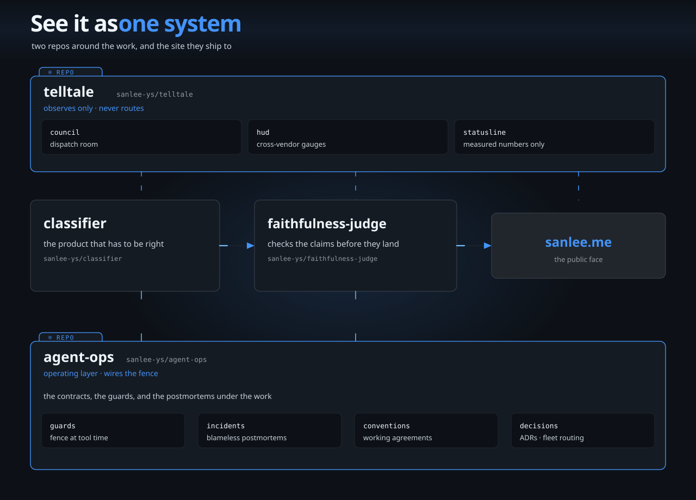

# San Lee

Senior Product Associate at JPMorganChase in Employee Platforms — working on product
for SharePoint Online and OneDrive. On the side I build AI systems in the open:
I set the direction, the contracts, and the bar; Claude does most of the typing
across Claude, Codex, Antigravity, Pi, and Grok. The evals and postmortems are
the proof. How the public repos fit together is on the portfolio:

<a href="https://sanlee.me">
  <picture>
    <source media="(prefers-color-scheme: dark)" srcset="images/one-system-v9-dark.svg">
    <source media="(prefers-color-scheme: light)" srcset="images/one-system-v9-light.svg">
    
  </picture>
</a>

---

Seoul National University MBA · B.A. Information Technology, Rutgers–New Brunswick · U.S. Army National Guard veteran (Qatar, OEF)

Outside work: photography, hiking, and supervision by a Scottish Fold named Sango.

<a href="https://www.linkedin.com/in/leesan/">LinkedIn</a> · <a href="https://www.instagram.com/sanleeeee/">Instagram</a> · <a href="https://vsco.co/sanlee">VSCO</a> · <a href="https://sanlee.me">Portfolio</a>

  

<em>Sango, Chief Nap Officer.</em>

